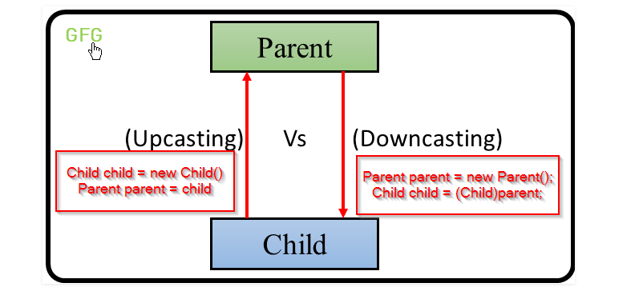

Runtime error
```java
public class Main {
    public static void main(String[] args) {
        Shape s = new Cylinder();
        Circle c= (Circle) s;

    }
}

class Shape {
}
class Cylinder extends Shape {
}
class Circle extends Shape {
}
```
Compile time error
```java
public class Main {
    public static void main(String[] args) {
        Circle c = new Shape();
        Circle c1 = (Circle)c;
    }
}

class Shape { }
class Cylinder extends Shape { }
class Circle extends Shape { }
```
